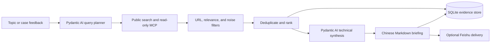

# Pydantic AI Technology Intelligence Briefing

A local-first Pydantic AI assistant that turns a topic into a Chinese daily
technology-intelligence briefing. It plans technical queries, retrieves
publicly accessible material, preserves original URLs, ranks signals, and
synthesizes the implementation details that matter: models, representations,
interfaces, validation layers, system boundaries, and open engineering gaps.

It is built for engineers who need a repeatable way to follow an area without
turning their daily report into a list of headlines.

## What It Does

- Plans bilingual technical queries with the configured Pydantic AI model
  provider, using GLM-4.7 by default.
- Searches public web engines plus read-only MCP sources for GitHub, arXiv,
  Hacker News, and Stack Exchange.
- Supports public-index or no-login discovery for selected Chinese platforms.
- Stores topics, feedback, retained sources, reports, and learning evidence in
  SQLite.
- Seeds reviewed domain knowledge graphs for Agent engineering, industrial AI,
  and medical-imaging AI so retrieved evidence can be mapped onto explicit
  entity-relation structures instead of flat text notes.
- Produces a Chinese `content collection report` with search directions,
  keywords, a concise technical brief, free-form detailed analysis, next
  research directions, implementation suggestions, and original URLs.
- Accepts case articles as feedback so future query planning can follow the
  technology object and implementation path implied by the article.
- Provides Feishu webhook, long-connection, and polling adapters for local
  deployments.

## Design Principles

1. **Evidence before prose.** Every retained source keeps its original URL.
2. **No login-state automation.** Private posts, internal search, comments,
   and recommendation feeds are intentionally out of scope.
3. **Synthesis, not a search log.** Short summaries name concrete mechanisms;
   detailed summaries choose their own evidence-led structure rather than
   filling a fixed theme form.
4. **Fail closed on weak evidence.** Search-page dumps, login pages, generic
   references, marketing-funnel posts, and known CAD medical false positives are
   filtered before ranking. A synthesis timeout retries with a smaller
   high-ranked evidence set instead of silently inventing material.
5. **Local control.** Secrets stay in ignored local configuration or deployment
   secret stores. The checked-in configuration contains no credentials.

## Architecture

The primary agent runtime is Pydantic AI. `SEARCH_ASSISTANT_MODEL_PROVIDER`
selects an OpenAI-compatible model provider such as GLM or DeepSeek; it does
not select a separate agent framework. The in-repo harness owns retrieval,
verification, calibration, review, memory, evaluation, and offline evolution.
MCP, public web, RSS/API sources, and optional Agent Reach routes sit below the
harness as read-only retrieval/tool layers.



Read the full module map in [docs/architecture.md](docs/architecture.md).

## Quick Start

Requirements: Python 3.11 to 3.13. The project is developed and tested with
Python 3.12 on Windows.

```powershell
py -3.12 -m venv .venv
.\.venv\Scripts\Activate.ps1
python -m pip install --upgrade pip
python -m pip install -c constraints-dev.txt -e ".[dev]"
Copy-Item .env.example .env.local
```

To test the optional Agent Reach retrieval path on another development
machine, install the reproducible extra into the same virtual environment:

```powershell
python -m pip install -c constraints-dev.txt -e ".[dev,agent-reach]"
agent-reach doctor --json
```

`doctor --json` shows which channels are ready. General web queries need an
Exa MCP backend (`mcporter`), GitHub needs `gh`, YouTube needs `yt-dlp` with a
JS runtime; Bilibili, V2EX and RSS work out of the box. Unconfigured channels
return empty and the hybrid provider falls back to MCP/browser search. Full
per-channel setup and the enable/disable recommendation are in
[docs/configuration.md#optional-agent-reach-install](docs/configuration.md#optional-agent-reach-install).

Set a model provider and its credentials only in `.env.local`, your shell, or
your deployment secret manager. Never commit a populated `.env.local` file.
See [docs/configuration.md](docs/configuration.md) for variable definitions and
the MCP/RSSHub setup.

Run a one-off daily briefing:

```powershell
python -m search_assistant.cli brief-run "AI industrial development"
```

The Markdown output is written to `<data-dir>/briefs/`. The default data
directory is `.local-data/` and is ignored by Git.

## Daily Briefing Contract

Each report is written in Chinese and always contains:

1. Search directions
2. Keywords
3. Search-content summary
4. Concise technical summary
5. Detailed evidence-led analysis
6. AI analysis judgment
7. Next research directions
8. Implementation suggestions
9. Original source URLs

The concise summary must identify an implementation path where the evidence
supports it. The detailed section uses two to five self-chosen analysis blocks;
it does not force every source into a technical-map checklist. The operating
contract is in [skills/content-collection-report/SKILL.md](skills/content-collection-report/SKILL.md).

## Search Coverage

The default `hybrid` provider combines read-only MCP tools with Bing, Baidu,
and Google public-result pages. DuckDuckGo can be added to the browser engine
pool when the local network can reach its HTML endpoint. Machines that have
[Agent Reach](https://github.com/Panniantong/Agent-Reach) installed can also
set `SEARCH_ASSISTANT_SEARCH_PROVIDER=agent-reach` to route retrieval through
`agent-reach doctor --json` and its selected read-only backends, or set
`SEARCH_ASSISTANT_AGENT_REACH_ENABLED=true` to add Agent Reach as a
supplementary pass after MCP/browser search inside the default `hybrid`
provider. Use
`python -m pip install -c constraints-dev.txt -e ".[dev,agent-reach]"` to make
that CLI available from the project virtual environment on a fresh checkout.
Platform capability is deliberately explicit:

| Source family | Access mode | Notes |
| --- | --- | --- |
| Agent Reach | Optional CLI capability router | Runs `agent-reach doctor --json`, then calls selected read-only tools such as `mcporter`, `bili`, `yt-dlp`, `gh`, or `opencli`; unavailable local routes do not count as coverage. |
| GitHub, arXiv, Hacker News, Stack Exchange | Read-only MCP | URL-bearing public results |
| General web | Public engine results | Bing, Baidu, Google; optional DuckDuckGo; markup and anti-bot behavior can vary |
| Bilibili | Public video-search API | No login state; retries with browser headers when public API returns transient anti-bot errors |
| Weibo, Zhihu, 36Kr, Juejin | Optional local RSSHub MCP | Public feeds only |
| WeChat, Xiaohongshu | Baidu-first public-index discovery with endpoint and public-engine fallback | Original target URLs only; no detail-page fetching |
| Toutiao | Public search page plus Baidu/public-engine fallback | Original `toutiao.com` URLs only; no detail-page fetching |
| Douyin and Kuaishou | Disabled RSSHub subscription slots | Require public account identifiers and route validation |
| LinkedIn, X, Reddit | Public-result discovery | No private, internal, or login-gated material |
| YouTube | Public search page plus public-result discovery | Original watch URLs only; no private or login-gated material |

Configured coverage is not proof that a platform produced useful results for a
particular topic. The report retains only sources that pass its relevance and
URL checks. Details: [docs/platform-coverage.md](docs/platform-coverage.md).

## Operations

Useful commands:

```powershell
python -m search_assistant.cli ask "Explain a technical concept"
python -m search_assistant.cli topic-add "industrial AI"
python -m search_assistant.cli brief-feedback "industrial AI" "focus on controlled MES agents" --url "https://example.com/case"
python -m search_assistant.cli brief-run "industrial AI"
python -m search_assistant.cli brief-loop "industrial AI" --interval-seconds 86400
# Track a fixed topic pool so cross-trajectory knowledge candidates accumulate:
python -m search_assistant.cli brief-loop "工业智能体" --topics "GraphRAG,医学影像" --max-runs 6 --interval-seconds 86400
python -m search_assistant.cli evolution-judge-calibrate --judge rule
python -m search_assistant.cli knowledge-graph-seed
python -m search_assistant.cli knowledge-graph-query "MES 工单 写回" --domain industrial-ai
python -m search_assistant.cli knowledge-graph-export agent-engineering
python -m search_assistant.cli evolution-offline-run --judge rule
python -m search_assistant.cli evolution-offline-run --judge llm --max-trajectories 10
python -m search_assistant.cli agentops-report
python -m search_assistant.cli provider-health
python -m search_assistant.cli trace-list
python -m search_assistant.cli ledger-list
python -m search_assistant.cli ledger-state
python -m search_assistant.cli gate-list
python -m search_assistant.cli checkpoint-list
python -m search_assistant.cli doctor
python -m search_assistant.cli eval-suite
python -m search_assistant.cli eval-replay
python -m search_assistant.cli skill-library-list
python -m search_assistant.cli skill-library-archive <slug> --reason "superseded"
python -m search_assistant.cli skill-learning-loop --bad-case <question_id> --fix "retry review parse failures"
python -m search_assistant.cli knowledge-candidate-list --layer weak_signal
python -m search_assistant.cli knowledge-candidate-list --status pending_user_confirm
python -m search_assistant.cli knowledge-candidate-confirm <candidate_id> --reviewer <name>
```

Use `--data-dir <path>` for an isolated run. Deployment, scheduling, and
Feishu guidance are in [docs/operations.md](docs/operations.md).

Briefing synthesis uses its own timeout (`BRIEFING_SYNTHESIS_TIMEOUT_SECONDS`,
default 120s) because large briefings (25+ sources) regularly take 60-70s; a
timeout there silently degrades the whole report to deterministic fallback
templates. Fallback degradation is audited as a
`briefing_synthesis_fallback` gate + ledger entry and the run is tagged
`synthesis_source=fallback` so degraded reports are visible.

The agent-ops commands expose append-only project ledger entries, project-state
snapshots, self-evolution gate records, trace spans, run checkpoints, and
search-provider health records from the local SQLite store. These are intended to
make daily briefing runs and self-evolution changes reviewable before they are
promoted. `knowledge-candidate-approve` requires a passing `eval-suite` report by
default; `eval-replay` reruns the questions from an existing evaluation report to
surface behavior drift before releasing new knowledge.

### Learning Loop And Versioned Skills

The learning loop closes the evaluation circle: a Bad Case fix is distilled into
a versioned skill draft (staging), the draft is regression-checked with the
shared eval-replay Delta + McNemar machinery, and only a statistically
significant improvement (p < 0.05) with zero regressed questions is merged into
the active skill library. Rejected or deprecated skills are archived under
`skills/.archive/` instead of being deleted, and every cycle writes a JSON
ledger plus a human-readable `REPORT.md` traceable to the triggering Bad Case.

```powershell
# List active/staging/archive versioned skills.
python -m search_assistant.cli skill-library-list

# Manually deprecate an active skill (moves to .archive/).
python -m search_assistant.cli skill-library-archive <slug> --reason "superseded"

# Full loop: bad case -> staging draft -> eval-replay regression -> release gate -> audit.
python -m search_assistant.cli skill-learning-loop --bad-case <question_id> --fix "<fix description>"
```

Skill files use frontmatter (`name` / `version` / `related`); the version number
is bumped on every modification. See
[docs/knowledge-graph-evolution-improvement-plan.md](docs/knowledge-graph-evolution-improvement-plan.md)
and the `search_assistant.skills` package for the loop design.

Knowledge candidates are layered by the latest validation gate metadata:
`validated_knowledge` can move toward human-reviewed release, `weak_signal`
keeps single-source or low-confidence clues for follow-up search, and
`rejected_noise` is retained only as an audit trail. This prevents weak but
useful leads from being deleted while keeping them out of trusted knowledge.

Candidates that pass every gate (≥1 briefing trajectory, ≥2 independent
domains, sufficient source authority, technical-not-marketing content,
non-low confidence) are promoted to `pending_user_confirm` by automatic
distillation — they only become `validated` after a user confirms them in
chat ("确认知识候选：<id>") or via `knowledge-candidate-confirm`. Marketing and
vague claims are rejected by the semantic quality gate instead of being
promoted. Topic strings that are rephrased across briefings ("AI Agent
Harness 上下文工程" vs "上下文工程") merge through an embedding similarity
fallback when an embedding endpoint is configured.

## Development And Verification

```powershell
$env:PYTHONUTF8 = "1"
py -3.12 -m pytest -q
```

The suite covers configuration, search parsing, MCP and RSSHub adapters,
briefing contracts, Pydantic AI model-provider JSON validation, Feishu
adapters, storage, verification, and regression cases for noisy search results. See
[docs/development.md](docs/development.md) for test boundaries.

## Documentation

- [Architecture](docs/architecture.md)
- [Configuration](docs/configuration.md)
- [Platform coverage and boundaries](docs/platform-coverage.md)
- [Domain knowledge graphs](docs/domain-knowledge-graphs.md)
- [Operations and scheduling](docs/operations.md)
- [Development guide](docs/development.md)
- [Security policy](SECURITY.md)
- [Contributing](CONTRIBUTING.md)

## Status And Limits

This is a working local deployment project, not a claim of exhaustive web or
social-media coverage. Search pages can change, block automation, or omit
results. Public-index discovery does not bypass access controls. Model output
is constrained to the retrieved evidence, but source material may still omit
implementation details; the report should name those gaps rather than fill them
with speculation.

## License

[MIT](LICENSE)
