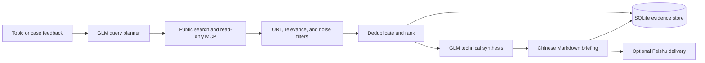

# Pydantic AI Technology Intelligence Briefing

A local-first Pydantic AI assistant that turns a topic into a Chinese daily
technology-intelligence briefing. It plans technical queries, retrieves
publicly accessible material, preserves original URLs, ranks signals, and
synthesizes the implementation details that matter: models, representations,
interfaces, validation layers, system boundaries, and open engineering gaps.

It is built for engineers who need a repeatable way to follow an area without
turning their daily report into a list of headlines.

## What It Does

- Plans bilingual technical queries with GLM-4.7 through Pydantic AI.
- Searches public web engines plus read-only MCP sources for GitHub, arXiv,
  Hacker News, and Stack Exchange.
- Supports public-index or no-login discovery for selected Chinese platforms.
- Stores topics, feedback, retained sources, reports, and learning evidence in
  SQLite.
- Produces a Chinese `content collection report` with search directions,
  keywords, a concise technical brief, free-form detailed analysis, next
  research directions, implementation suggestions, and original URLs.
- Accepts case articles as feedback so future query planning can follow the
  technology object and implementation path implied by the article.
- Provides Feishu webhook, long-connection, and polling adapters for local
  deployments.

## Design Principles

1. **Evidence before prose.** Every retained source keeps its original URL.
2. **No login-state automation.** Private posts, internal search, comments,
   and recommendation feeds are intentionally out of scope.
3. **Synthesis, not a search log.** Short summaries name concrete mechanisms;
   detailed summaries choose their own evidence-led structure rather than
   filling a fixed theme form.
4. **Fail closed on weak evidence.** Search-page dumps, login pages, generic
   references, and known CAD medical false positives are filtered before
   ranking. A synthesis timeout retries with a smaller high-ranked evidence
   set instead of silently inventing material.
5. **Local control.** Secrets stay in ignored local configuration or deployment
   secret stores. The checked-in configuration contains no credentials.

## Architecture



Read the full module map in [docs/architecture.md](docs/architecture.md).

## Quick Start

Requirements: Python 3.11 to 3.13. The project is developed and tested with
Python 3.12 on Windows.

```powershell
py -3.12 -m venv .venv
.\.venv\Scripts\Activate.ps1
python -m pip install --upgrade pip
python -m pip install -e ".[dev]"
Copy-Item .env.example .env.local
```

Set a model provider and its credentials only in `.env.local`, your shell, or
your deployment secret manager. Never commit a populated `.env.local` file.
See [docs/configuration.md](docs/configuration.md) for variable definitions and
the MCP/RSSHub setup.

Run a one-off daily briefing:

```powershell
python -m search_assistant.cli brief-run "AI industrial development"
```

The Markdown output is written to `<data-dir>/briefs/`. The default data
directory is `.local-data/` and is ignored by Git.

## Daily Briefing Contract

Each report is written in Chinese and always contains:

1. Search directions
2. Keywords
3. Search-content summary
4. Concise technical summary
5. Detailed evidence-led analysis
6. AI analysis judgment
7. Next research directions
8. Implementation suggestions
9. Original source URLs

The concise summary must identify an implementation path where the evidence
supports it. The detailed section uses two to five self-chosen analysis blocks;
it does not force every source into a technical-map checklist. The operating
contract is in [skills/content-collection-report/SKILL.md](skills/content-collection-report/SKILL.md).

## Search Coverage

The default `hybrid` provider combines read-only MCP tools with Bing, Baidu,
and Google public-result pages. DuckDuckGo can be added to the browser engine
pool when the local network can reach its HTML endpoint. Machines that have
[Agent Reach](https://github.com/Panniantong/Agent-Reach) installed can also
set `SEARCH_ASSISTANT_SEARCH_PROVIDER=agent-reach` to route retrieval through
`agent-reach doctor --json` and its selected read-only backends, or set
`SEARCH_ASSISTANT_AGENT_REACH_ENABLED=true` to try Agent Reach first inside the
default `hybrid` provider and then fall back to MCP/browser search. Platform
capability is deliberately explicit:

| Source family | Access mode | Notes |
| --- | --- | --- |
| Agent Reach | Optional CLI capability router | Runs `agent-reach doctor --json`, then calls selected read-only tools such as `mcporter`, `bili`, `yt-dlp`, `gh`, or `opencli`; unavailable local routes do not count as coverage. |
| GitHub, arXiv, Hacker News, Stack Exchange | Read-only MCP | URL-bearing public results |
| General web | Public engine results | Bing, Baidu, Google; optional DuckDuckGo; markup and anti-bot behavior can vary |
| Bilibili | Public video-search API | No login state; retries with browser headers when public API returns transient anti-bot errors |
| Weibo, Zhihu, 36Kr, Juejin | Optional local RSSHub MCP | Public feeds only |
| WeChat, Xiaohongshu | Baidu-first public-index discovery with endpoint and public-engine fallback | Original target URLs only; no detail-page fetching |
| Toutiao | Public search page plus Baidu/public-engine fallback | Original `toutiao.com` URLs only; no detail-page fetching |
| Douyin and Kuaishou | Disabled RSSHub subscription slots | Require public account identifiers and route validation |
| LinkedIn, X, Reddit | Public-result discovery | No private, internal, or login-gated material |
| YouTube | Public search page plus public-result discovery | Original watch URLs only; no private or login-gated material |

Configured coverage is not proof that a platform produced useful results for a
particular topic. The report retains only sources that pass its relevance and
URL checks. Details: [docs/platform-coverage.md](docs/platform-coverage.md).

## Operations

Useful commands:

```powershell
python -m search_assistant.cli ask "Explain a technical concept"
python -m search_assistant.cli topic-add "industrial AI"
python -m search_assistant.cli brief-feedback "industrial AI" "focus on controlled MES agents" --url "https://example.com/case"
python -m search_assistant.cli brief-run "industrial AI"
python -m search_assistant.cli brief-loop "industrial AI" --interval-seconds 86400
python -m search_assistant.cli doctor
python -m search_assistant.cli eval-suite
```

Use `--data-dir <path>` for an isolated run. Deployment, scheduling, and
Feishu guidance are in [docs/operations.md](docs/operations.md).

## Development And Verification

```powershell
$env:PYTHONUTF8 = "1"
py -3.12 -m pytest -q
```

The suite covers configuration, search parsing, MCP and RSSHub adapters,
briefing contracts, GLM JSON validation, Feishu adapters, storage, verification,
and regression cases for noisy search results. See
[docs/development.md](docs/development.md) for test boundaries.

## Documentation

- [Architecture](docs/architecture.md)
- [Configuration](docs/configuration.md)
- [Platform coverage and boundaries](docs/platform-coverage.md)
- [Operations and scheduling](docs/operations.md)
- [Development guide](docs/development.md)
- [Security policy](SECURITY.md)
- [Contributing](CONTRIBUTING.md)

## Status And Limits

This is a working local deployment project, not a claim of exhaustive web or
social-media coverage. Search pages can change, block automation, or omit
results. Public-index discovery does not bypass access controls. Model output
is constrained to the retrieved evidence, but source material may still omit
implementation details; the report should name those gaps rather than fill them
with speculation.

## License

[MIT](LICENSE)
