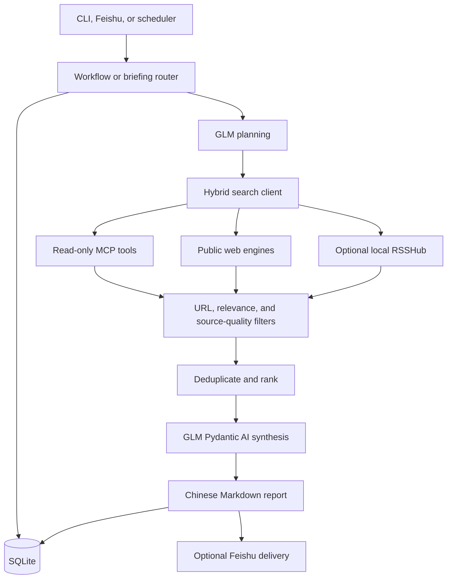

# Architecture

## Runtime Topology

The project has two adjacent workflows:

- **Question answering:** retrieve public evidence, generate an answer,
  calibrate and review it, then persist the visible search record and evidence.
- **Daily briefing:** expand a topic into technical queries, retrieve and rank
  public sources, synthesize a Chinese technical report, and store the report
  with all retained original URLs.

## Daily Briefing Lifecycle

1. A topic is created or resumed from a subscription.
2. User feedback and case URLs are loaded as planning signals. A case URL is
   preserved even when public indexing cannot enrich it.
3. GLM proposes focused technical queries. Deterministic coverage queries add
   architecture, implementation, evaluation, and source-family routes.
4. Retrieval runs concurrently with a bounded budget. Slow sources do not
   erase completed results.
5. The service rejects malformed search-page text, generic reference pages,
   platform wrapper URLs, login pages, domain leakage from `site:` queries, and
   topic-specific false positives.
6. Results are normalized, compacted, deduplicated, ranked, and persisted.
7. GLM receives ranked evidence and produces structured JSON. The report's
   detailed section remains free-form; evidence anchors preserve source
   traceability without forcing a repeated per-theme schema.
8. On a synthesis timeout, the runtime retries once with a smaller ranked
   evidence set. If both attempts fail, the deterministic fallback names the
   evidence limitation rather than asserting unobserved deployment facts.

## Persistence

`MemoryStore` uses SQLite. Key tables include topic subscriptions, topic
feedback, collected sources, daily briefings, interactions, answers, claim
evidence, profiles, reports, runtime sessions, skill drafts, immutable
trajectories, trajectory evaluations, domain knowledge candidates, reviewed
domain knowledge graphs, and candidate-to-graph links.

Domain knowledge graphs are stored as graph headers, entity nodes, and typed
relation edges. They intentionally keep natural-language summaries next to
entity-relation triples: the triples support GraphRAG-style navigation and
entity disambiguation, while the summaries preserve the semantic nuance that
would be lost by reducing every domain claim to a bare triple.

Self-evolution output remains a reviewable candidate first. Search-derived
domain knowledge candidates are linked to the best matching reviewed graph
entity through immutable bridge records, but they are not promoted into graph
facts until a human or later review workflow validates the evidence.

The database is scoped by user and chat where applicable. The default location
is `.local-data/assistant.sqlite3`; use `--data-dir` for isolated test or
deployment environments.

## Model Boundary

`GLMPydanticAIRuntime` uses Pydantic AI with an OpenAI-compatible GLM endpoint.
It performs query planning and report synthesis. The code accepts a legacy
DeepSeek runtime for compatibility. Model secrets are passed only through
runtime environment configuration, never through reports, SQLite source text,
or checked-in files.

## Safety Boundaries

- Retrieval sources must return an original `http` or `https` URL.
- MCP search bindings must be read-only.
- Login-gated platform content and private social data are not collected.
- Source titles alone do not justify an architecture claim; the synthesis prompt
  asks the model to state missing evidence.
- A separate scope review reduces unsupported industry-wide or inevitable
  claims while preserving source-backed technical detail.

## Continuous Evolution: Phase One

Phase one separates stable online execution from offline, reviewable evolution:

1. Every persisted answer appends one trajectory snapshot containing the
   question, search record, draft, calibration, review, final answer, active
   skills, and runtime metadata. SQLite triggers reject trajectory updates and
   deletes.
2. The evaluation suite verifies the result, process, and answer quality as
   separate structures. A diagnosis service routes failures to a candidate
   update carrier without changing prompts, skills, or program code.
3. Daily briefing themes become deduplicated domain knowledge candidates backed
   by original source URLs. Candidates remain reviewable until an explicit
   evidence gate validates them; deprecated records and status events are kept
   for rollback and audit.
4. Learning reports expose trajectory and candidate status. They are reporting
   artifacts, not trusted evidence and not an automatic release mechanism.
